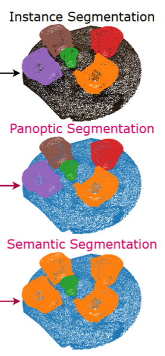
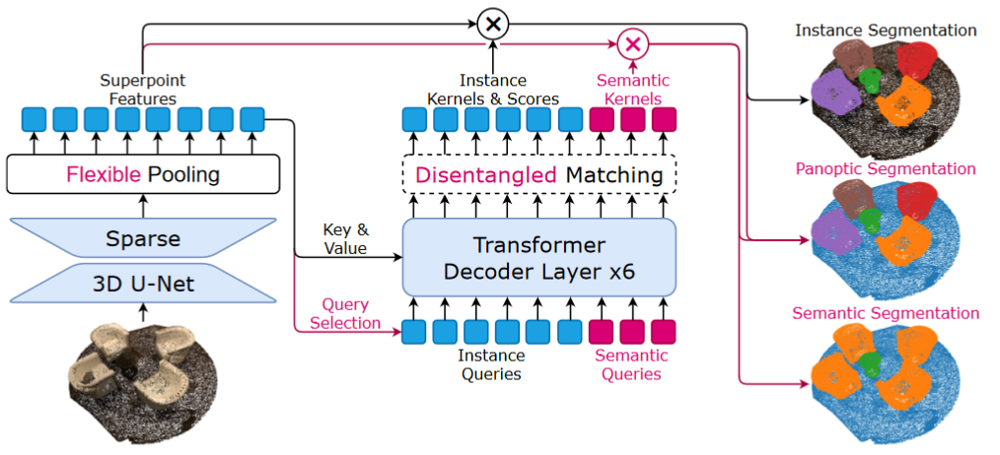

## 相关概念

- Instance Segmentation (实例分割)
- Panoptic Segmentation (全景分割)
- Semantic Segmentation (语义分割)

## 开源评测数据集

- [S3DIS](https://paperswithcode.com/dataset/s3dis): `temp/data/S3DIS` `17G`  （已下载完成）
- [ScanNet](http://www.scan-net.org/): `temp/data/scannetv2` `21G`（已下载完成）
- [KITTI](https://www.cvlibs.net/datasets/kitti/): `temp/data/KITTI` `39G`  （已经下载完成）
- [Semantic KITTI](http://www.semantic-kitti.org/): `temp/data/SemanticKITTI` `80G`（已经下载完成）

## 模型改进方法

### 修改点云特征提取器

1. 使用`PointNet++`替代原始网络中的`Sparse 3D U-Net`

    > 原模型参数量：`17515048`，修改后的模型参数量：`8406831`

    > 如何计算模型参数量？
    > 项目中`test/test_cal_params_of_model.py`脚本中的`count_parameters()`函数能够计算传入的模型的总参数量，通过修改`cfg`变量来修改网络架构
    > 执行脚本需要先进入docker容器中的项目文件夹，然后执行命令`python test/test_cal_params_of_model.py`

    实验1：修改多组网络参数，分别进行实验，对比实际测试效果

2. 使用`PointTransformerV2`中的`PointEmbedding`层替代原始网络中的`Sparse 3D U-Net`

3. 使用`PointTransformerV3`中的改进后的`PointEmbedding`层替代原始网络中的`Sparse 3D U-Net`

==注意：受限于实验设备资源（单张Nvidia RTX3090显卡24GB显存），我们调整了原OneFormer3D模型的参数量，将`ScanNetQueryDecoder`中的`num_layers`从`6`修改成了`3`，`d_model`从`256`修改成了`128`，`num_heads`从`8`修改成了`4`，`hidden_dim`从`512`修改成了`256`，之后的模型结构修改都是基于这个基本模型骨架，以下是修改后的各模型参数量的对比：==

实验设置：

| Point Cloud Embedding | Sparse 3D U-Net   | PointNet++  | PTV2  | PTV3 |
| ---------- | -------- | ---- | ---- | ---- |
| Parameters | 11624616 |2516400|671496|688360|
| Loss (100 eps) | 3.94 | 8.73 | 6.62 | 7.20 |
| Seg_Loss | 0.163 | 0.380 | 0.480 | 0.495 |
| 其他指标详见论文（在ScanNetV2数据集上的测试结果等） |          |      |      |      |

### 修改损失函数

- 将原来的平衡权重修改成了可训练的参数
- 添加边界损失（boundary_loss）
- 在dice_loss中添加了focal_loss，用于平衡样本分布不均的问题
- 对于各个损失部分都添加了数值稳定处理，防止其中某一个损失函数对训练的影响较大

## 模型改进：方案二

> 基于`SPFormer`框架进行改进，修改模型backbone、改进损失函数

1. 修改模型Backbone
   
   1. backbone.py:

      - 添加了SELayer注意力机制以增强特征学习
      - 添加了DenseBlock替代原有的ResidualBlock,提供更密集的特征连接
      - 改进了UBlock结构,支持可选的dense block和SELayer

   2. query_decoder.py:

      - 增强了Transformer结构,添加了pre-norm和FFN
      - 改进了多头注意力机制的实现
      - 添加了multi-scale fusion
      - 增强了mask预测的非线性能力

   3. spformer.py:

      - 添加了FeatureAggregation模块进行特征聚合
      - 改进了后处理策略,添加了diversity penalty
      - 添加了对比学习版本SPFormerWithContrastiveLearning
      - 增强了特征提取和规范化流程

2. 改进损失函数

   1. 多样化的损失函数:

      - 添加了 LovaszHinge 损失以更好地优化 IoU
      - 引入了 GIoU 损失来处理空间位置关系
      - 改进了 Focal Loss 的平衡机制
      - 增强了 Dice Loss 的数值稳定性

   2. 增强的匹配策略:

      - EnhancedHungarianMatcher 支持多种损失度量
      - 添加了点数阈值过滤机制
      - 考虑多种匹配成本

   3. 质量感知的损失权重:

      - 基于 IoU 分数的权重调整
      - 引入标签平滑机制
      - 自适应损失平衡

   4. 辅助任务优化:

      - 改进了辅助损失的计算
      - 添加中间层监督
      - 多尺度特征融合

   5. 数值稳定性优化:

      - 添加 epsilon 项避免除零
      - 改进了 IoU 计算方法
      - 更好的梯度传播机制

## 实验结果分析

### 实验设置

- num_epochs = 100
- batch_size = 4
- 

### 日志文件

日志文件位于：`SPFormer/exps`中

- `spf_scannet_ep100`: SPFormer在ScanNet数据集上的训练100轮的结果
- `spf_v2_scannet_ep100`: 修改了backbone的SPFormer模型在ScanNet数据集上的训练100轮的结果
- `spf_v2_scannet_ep100_loss`: 修改了backbone的SPFormer模型 + 使用改进后的损失函数在ScanNet数据集上的训练100轮的结果